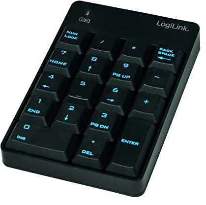
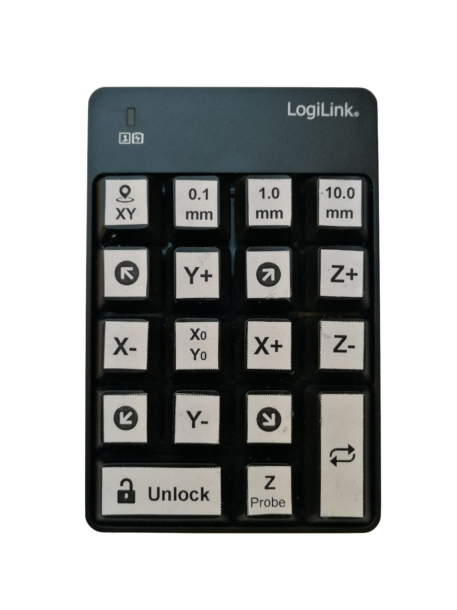
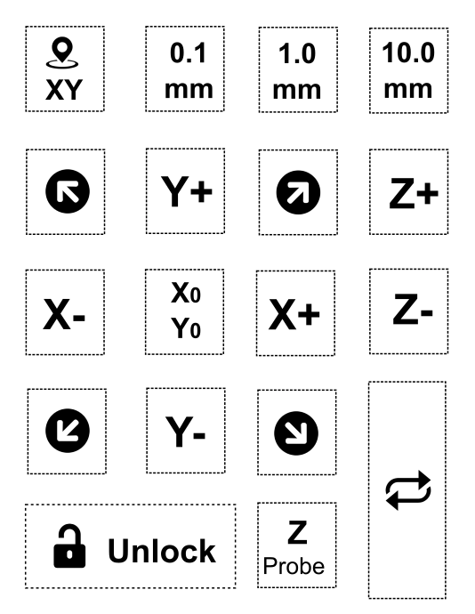

# cncjs-pendant-numpad
A simple pendant for using cncjs with a num pad (as Wireless/USB Input). The code is based on [cncjs-pendant-keyboard](https://github.com/cncjs/cncjs-pendant-keyboard)






--

NOTICE: Tested with LogiLink num pad on Linux/Raspbian (Raspberry Pi).
Also tested with Exibel SK-051AG  num pad on Linux/Raspbian (Raspberry Pi).
(default options are set to Exibel vendor- and productID (which is the same as LogiLink), see description below for running with other vendors/products)


--
## Installation

Make sure you have installed the following packages

```
libusb-1.0-0-dev
libudev-dev
```
These can be installed with apt-get.

After cloning the repository to your work directory, change into this directory and run

```
npm install
```

## Add device Rules for non-root users

Some additional configurations are needed for making the device working for non-root users.

First create a new file called 

```
/etc/udev/rules.d/50-hid.rules
``` 

add the following line as content, which grants access to the hid device for non-root users.

```
KERNEL=="hidraw*", GROUP="input", MODE="0660"`
```

Then run the following command for making the changes work ( a reboot will also do this job).

```
sudo udevadm trigger
```


## Usage
Run `bin/cncjs-pendant-numpad.js` to start. Pass --help to `cncjs-pendant-numpad.js` for more options.

```
bin/cncjs-pendant-numpad.js --help
```

Hotkeys:

|     Key    	|           Function           	|
|:----------:	|:----------------------------:	|
| NUM  LOCK  	| zero out work offset x and y 	|
| /          	| step in 0.1 units            	|
| *          	| step in 1.0 units            	|
| Back Space 	| step in 10.0 units           	|
| 7 (HOME)   	| move -X and +Y               	|
| 8 (UP)     	| move +Y                      	|
| 9 (PG UP)  	| move +X and +Y               	|
| 4 (LEFT)   	| move -X                      	|
| 5          	| repeat last action           	|
| 6 (RIGHT)  	| move +X                      	|
| 1 (END)    	| move -X and -Y               	|
| 2 (DOWN)   	| move -Y                      	|
| 3 (PG DN)  	| move +X and -Y               	|
| 0 (INS)    	| unlock ($X GRBL)                       	|
| . (DEL)    	| probe tool offset            	|
| -          	| z axis up                    	|
| +          	| z axis down                  	|
| ENTER      	| home X and Y                 	|



You can download a SVG file for labels [here](docs/key_labels.svg).

### Probe Offset
The probe offset default is set to 1.56 mm ( i am using a piece of PCB with a thickness of 1.56 mm). You can override this by giving the pendant
an extra start parameter for probe offset.

```
--zProbeThickness <value>
```

### Using with other Num Pad's than LogiLink

Because the keycodes for HID devices are the same for all keyboards, this should also work with 
other Numpad's than LogiLink. Just find out the vendorID and productID of your device and
start the pendant with --vendorId and --productId parameter.

Just run the following command to find out the vendor- and productId of your device

```
lsusb
```
The output might look like 

```
Bus 001 Device 004: ID 062a:4101 MosArt Semiconductor Corp. Wireless Keyboard/Mouse
```

In this example the vendorID is 0x062a and the productID 0x4101. So you you need
to start the pendant with the following additional parameters

```
--vendorId 0x062a --productId 0x4101
```
----------------------------------------

# Install cncjs-pendant-numpad

Do the following to clone and install the cncjs-pendant-numpad software:

```
# Clone the github repo for perivar/cncjs-pendant-numpad
cd ~
git clone https://github.com/perivar/ts-cncjs-pendant-numpad.git
cd ts-cncjs-pendant-numpad
npm install -g
```

Note that there will be quite a few warnings, such as deprecated modules and compiler warnings.  You can ignore this for now, though someday work should be done fix this...!  Anyone want to attack this problem?!

----------------------------------------

# Configuring for auto-start

There are many ways in Linux to configure auto-start on boot.  This example shows using [Production Process Manager [PM2]](http://pm2.io):

```
# Install Production Process Manager [PM2]
npm install pm2 -g

# Setup PM2 Startup Script
pm2 startup

#[PM2] Init System found: systemd
#[PM2] To setup the Startup Script, copy/paste the following command:
sudo env PATH=$PATH:/home/pi/.nvm/versions/node/v10.24.1/bin /home/pi/.nvm/versions/node/v10.24.1/lib/node_modules/pm2/bin/pm2 startup systemd -u pi --hp /home/pi

# Start Num Pad Remote Pendant for CNCjs (connected to serial device @ /dev/ttyUSB0) with PM2
pm2 start $(which cncjs-pendant-numpad.js) -- -p "/dev/ttyUSB0"

# Set current running apps to startup
pm2 save

# Get list of PM2 processes
pm2 list
```
